 <!-- ------------------------Document header ------------------------------------>
 
 ___

   
   

<!-- ------------------------Document TITLE PAGE --------------------------------->
 

AWS to Gantry Protocol Specification

Protocol Description

REV : 1.0

   
   
   
   

|Date |Revision | Change log| Author|
|:---| :----: | :----: |:---|
|03/07/2023|1.0|First release| M. Rispoli|

# 1. TABLE OF CONTENTS   

- [1. TABLE OF CONTENTS](#1-table-of-contents)
- [2. SCOPE](#2-scope)
- [3. PROTOCOL GENERAL DESCRIPTION](#3-protocol-general-description)
  - [3.1. OVERVIEW](#31-overview)
    - [3.1.1. AWS Command channel description](#311-aws-command-channel-description)
    - [3.1.2. Gantry Event channel  description](#312-gantry-event-channel--description)
    - [3.1.3. Command and Event frame exchange scheme](#313-command-and-event-frame-exchange-scheme)
  - [3.2. DATA FRAME STRUCTURE](#32-data-frame-structure)
    - [3.2.1. (COMMAND) DATA FRAME FORMAT](#321-command-data-frame-format)
    - [3.2.2. Ack(OK) DATA FRAME FORMAT](#322-ackok-data-frame-format)
    - [3.2.3. Ack(NOK) DATA FRAME FORMAT](#323-acknok-data-frame-format)
    - [3.2.4. Ack(EXECUTING) DATA FRAME FORMAT](#324-ackexecuting-data-frame-format)
    - [3.2.5. Ack(NA) DATA FRAME FORMAT](#325-ackna-data-frame-format)
    - [3.2.6. EVENT(EXECUTED, OK) DATA FRAME FORMAT](#326-eventexecuted-ok-data-frame-format)
    - [3.2.7. EVENT(EXECUTED, NOK) DATA FRAME FORMAT](#327-eventexecuted-nok-data-frame-format)
    - [3.2.8. (GANTRY EVENT) DATA FRAME FORMAT](#328-gantry-event-data-frame-format)
  - [3.3. DATA TYPE AND ENCODING FORMAT](#33-data-type-and-encoding-format)
    - [3.3.1. Encoding format](#331-encoding-format)
    - [3.3.2. Items separation](#332-items-separation)
    - [3.3.3. Command/Event identifier rules](#333-commandevent-identifier-rules)
- [4. AWS COMMAND DESCRIPTION](#4-aws-command-description)
  - [4.1. EXPOSURE PREPARATION COMMANDS](#41-exposure-preparation-commands)
    - [4.1.1. EXEC\_OpenStudy()](#411-exec_openstudy)
    - [4.1.2. EXEC\_CloseStudy()](#412-exec_closestudy)
    - [4.1.3. SET\_ProjectionList()](#413-set_projectionlist)
    - [4.1.4. EXEC\_ArmPosition()](#414-exec_armposition)
    - [4.1.5. EXEC\_AbortProjection()](#415-exec_abortprojection)
    - [4.1.6. EXEC\_TrxPosition()](#416-exec_trxposition)
    - [4.1.7. SET\_TomoConfig()](#417-set_tomoconfig)
    - [4.1.8. SET\_ExposureMode()](#418-set_exposuremode)
    - [4.1.9. SET\_ExposureData()](#419-set_exposuredata)
    - [4.1.10. SET\_EnableXrayPush()](#4110-set_enablexraypush)
    - [4.1.11. GET\_ReadyForExposure()](#4111-get_readyforexposure)
    - [4.1.12. EXEC\_StartXraySequence()](#4112-exec_startxraysequence)
  - [4.2. GANTRY COMPONENT STATUS COMMANDS](#42-gantry-component-status-commands)
    - [4.2.1. GET\_Compressor()](#421-get_compressor)
    - [4.2.2. GET\_Components()](#422-get_components)
    - [4.2.3. GET\_Trx()](#423-get_trx)
    - [4.2.4. GET\_Arm()](#424-get_arm)
    - [4.2.5. GET\_TubeTemperature()](#425-get_tubetemperature)
  - [4.3. SYSTEM COMMANDS](#43-system-commands)
    - [4.3.1. SET\_Language()](#431-set_language)
    - [4.3.2. EXEC\_PowerOff()](#432-exec_poweroff)
- [5. GANTRY EVENT DESCRIPTION](#5-gantry-event-description)
  - [5.1. EXPOSURE CONTEST](#51-exposure-contest)
    - [5.1.1. EVENT\_XrayPushButton()](#511-event_xraypushbutton)
    - [5.1.2. EVENT\_ReadyForExposure()](#512-event_readyforexposure)
    - [5.1.3. EVENT\_XrayPulseCompleted()](#513-event_xraypulsecompleted)
    - [5.1.4. EVENT\_XraySequenceCompleted()](#514-event_xraysequencecompleted)
  - [5.2. GENERAL CONTEST](#52-general-contest)
    - [5.2.1. EVENT\_GantryStatus()](#521-event_gantrystatus)
    - [5.2.2. EVENT\_SelectProjection()](#522-event_selectprojection)
    - [5.2.3. EVENT\_AbortProjection()](#523-event_abortprojection)
    - [5.2.4. EVENT\_Compressor()](#524-event_compressor)
    - [5.2.5. EVENT\_Components()](#525-event_components)
- [6. WORKFLOWS](#6-workflows)
  - [6.1. Arm Positioning Process Flowchart](#61-arm-positioning-process-flowchart)
  - [6.2. Trx Positioning Process Flowchart](#62-trx-positioning-process-flowchart)
  - [6.3. 2D Manual Exposure  Flowchart](#63-2d-manual-exposure--flowchart)
  - [6.4. 2D AEC  Exposure  Flowchart](#64-2d-aec--exposure--flowchart)
  - [6.5. 3D Manual Exposure  Flowchart](#65-3d-manual-exposure--flowchart)
  - [6.6. 3D AEC  Exposure  Flowchart](#66-3d-aec--exposure--flowchart)
  - [6.7. Combo Manual Exposure  Flowchart](#67-combo-manual-exposure--flowchart)
  - [6.8. AEC Combo  Exposure  Flowchart](#68-aec-combo--exposure--flowchart)
  - [6.9. Dual Energy Manual Exposure  Flowchart](#69-dual-energy-manual-exposure--flowchart)
  - [6.10. Dual Energy AEC Exposure  Flowchart](#610-dual-energy-aec-exposure--flowchart)
- [7. APPENDIX](#7-appendix)
  - [7.1. Collimator Filter Table](#71-collimator-filter-table)
  - [7.2. Collimation Format Table](#72-collimation-format-table)
  - [7.3. Compressor Paddle Table](#73-compressor-paddle-table)
  - [7.4. Arm Projection Table](#74-arm-projection-table)
  - [7.5. Components Option Table](#75-components-option-table)
  - [7.6. Collimator Component Table](#76-collimator-component-table)
  - [7.7. TRX Target Table](#77-trx-target-table)
  - [7.8. Gantry Language Table](#78-gantry-language-table)
  - [7.9. Tomo Configuration File Description](#79-tomo-configuration-file-description)
    - [7.9.1. Tomo Configuration Table](#791-tomo-configuration-table)
  - [7.10. Detector List Table](#710-detector-list-table)
  - [7.11. Exposure List Table](#711-exposure-list-table)
  - [7.12. Not Ready For Exposure conditions](#712-not-ready-for-exposure-conditions)
  - [7.13. Gantry Operating Status](#713-gantry-operating-status)
  

# 2. SCOPE

This document describes the communication protocol used to exchange data and commands 
from the AWS software and MCPU_MASTER (Gantry MainCpu)  software.

In this document the following terms will be used:
+ AWS: Acquisition software;
+ Gantry or MainCpu or MCPU_MASTER: those terms shall be considered synonyms of the software controlling the Gantry system;
+ Command(): this is a notation for the AWS Command Frame;
+ Event(): this is a notation of a gantry Async Event frame;
+ Ack(): this is a notation for the Gantry acknowledge of an AWS Command frame;

# 3. PROTOCOL GENERAL DESCRIPTION

## 3.1. OVERVIEW 

The protocol provides two data frame channels:
+ AWS Command channel: this is a communication channel where AWS sends Command() to Gantry;
+ Gantry Event channel: this is a communication channel where Gantry sends Event() to AWS;

### 3.1.1. AWS Command channel description

The AWS sends command to Gantry with Command() data frame.
The Gantry shall acknowledge the commands with the Ack() frame:
+ The Ack frame can signal a command completion event: in this case the Ack frame may provide optional data as a result of the executed command;
+ The Ack frame can signal a command delayed event: in this case Gantry notifies that the command takes time to be executed.
  + In this case a further Event() frame will be sent to AWS as soon as the executing command termines.

+ This communication channel is based on a Tcp/Ip protocol with a dedicated port on the local-host device.
+ The address of the channel is: 127.0.0.1@10000;
+ The AWS shall connect to that address as a Client.

 > NOTE: the address may be changed in case of conflict with other devices. The AWS should store/retrive this address
  in a proper AWS configuration file.

### 3.1.2. Gantry Event channel  description

The Gantry sends event to AWS with Event() frames:
+ The Event() can be a device status change notify;
+ The Event() can be a Command Termination event related to a pending AWS Executing command;

+ This communication channel is based on a Tcp/Ip protocol with a dedicated port on the local-host device.
+ The address of the channel is: 127.0.0.1@10001;
+ The AWS shall connect to that address as a Client.
  
 > NOTE: the address may be changed in case of conflict with other devices. The AWS should store/retrive this address
  in a proper AWS configuration file.

### 3.1.3. Command and Event frame exchange scheme

 

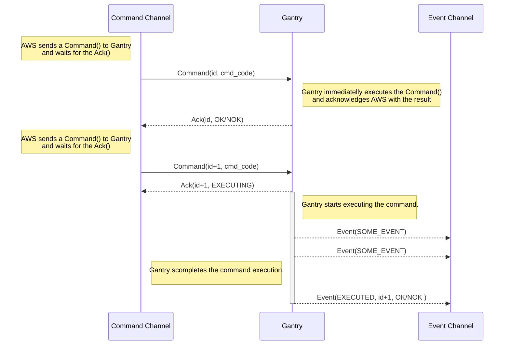
 

## 3.2. DATA FRAME STRUCTURE
 
The data frame formats for the Command channel:
      
    [1]  <ID % someCOMMAND PAR1 .. PAR-N %>           Command() frame;
    [2]  <ID % OK  OPT1 .. OPT-N %>           Ack() frame for an immediate command execution with success;
    [3]  <ID % NOK errcode "error_string" %>  Ack() frame for an immediate command execution with unsuccess;
    [4]  <ID % EXECUTING %>                   Ack() frame for a delayed command completion;
    [5]  <ID % NA %>                          Ack() frame for a not available command;

The data frame formats for the Event channel:

    [6]  <seq % EXECUTED ID OK OPT1 .. OPT-N %>     Event() for a successfully completed command termination ;
    [7]  <seq % EXECUTED ID NOK errcode "error_string" %>  Event() for a failur completed command termination ;
    [8]  <seq % someEVENT PAR1 .. PAR-N  %>            Gantry Event() frame;

    Where:
    '<' and '>  : delimitators of the data frame
    '%'         : delimitators of the frame content;
    ID          : special command identification code (integer type)
    EXECUTING   : reserved keyword for the Command Delayed Ack() frame;
    EXECUTED    : reserved keyword for the Gantry Command Completed Event() frame;
    someCOMMAND : This is a Command identifier string 
    someEVENT   : This is a Event identifier string 
    PAR1 - PAR-N: list of command/event parameters, in string format, separated by spaces;
    OPT1 - OPT-N: list of optional parameters, in string format, separated by spaces;
    errcode     : in case of a NOK condition (Event() or Ack()) it represent the error identifier code;
    "error string": : in case of a NOK condition (Event() or Ack()) it represent the optional error string descriptor;

 
### 3.2.1. (COMMAND) DATA FRAME FORMAT
 
 The **COMMAND** data frame frame format is based on the form [1] as following described:
 
    <ID % someCOMMAND PAR-1 .. PAR-N %>
    Where:
    someCOMMAND: is a String defining a command code;
    PAR-1, .. , PAR-N: are a list of parameters of the command.
   

### 3.2.2. Ack(OK) DATA FRAME FORMAT

  The **Ack(OK)** data frame format is based on the form [2];  
  MainCpu acknowledge a Command() frame with this frame when a command has been immediatelly successfully processed.
   
    <ID % OK OPT1 ... OPT-N %>
    Where:
    ID: is the ID of the processed Command Frame
    OPT1 .. OPT-N: are optional parameters or tags sent back to the AWS.
     
 
### 3.2.3. Ack(NOK) DATA FRAME FORMAT

The **Ack(NOK)** data frame format is based on the form [3];  

MainCpu acknowledge a Command() frame with this frame in the case the command immediatelly fails or
cannot be executed.
  
    <ID % NOK errcode "Error string"" %>
    Where:
    ID: is the ID of the processed Command;
    errcode: is the reason of the command failure;
    "Error string": is an optional error description string.
  

### 3.2.4. Ack(EXECUTING) DATA FRAME FORMAT

The **Ack(EXECUTING)** data frame format is based on the form [4];  
MainCpu acknowledge a Command() frame with this frame  when a command takes time to completes.
 
    <ID % EXECUTING %>
    Where:
    ID: is the ID of the processed Command Frame;
    EXECUTING: is a key string identifying the delayed acknowledge frame;
    
  >NOTE:As soon as the command termines, the MainCpu will send the Event(EXECUTED) frame to the AWS.
 

### 3.2.5. Ack(NA) DATA FRAME FORMAT

The **Ack(NA)** data frame format is based on the form [5];  
MainCpu acknowledge a Command() frame with this frame in the case the requested command should not be implemented or not supported.
  
    <ID % NA %>

### 3.2.6. EVENT(EXECUTED, OK) DATA FRAME FORMAT

The **Event(EXECUTED,OK)** data frame format is based on the form [6];  
MainCpu sends this Event() to notify the Successfully completed command execution.

    <seq % EXECUTED ID OK OPT-1 ... OPT-N %>
    Where:
    seq: is an incremental sequence number;
    ID: is the Command-ID of the processed Command();
    OPT-1, OPT-N: optional values returned to the AWS;

 > The AWS shall never acknowledge this frame.   
   
### 3.2.7. EVENT(EXECUTED, NOK) DATA FRAME FORMAT

The **Event(EXECUTED,NOK)** data frame format is based on the form [7];  
MainCpu sends this Event() to notify the Unseccessfully completed command execution.

    <seq % EXECUTED ID NOK errcode "err_string"%>
    Where:
    seq: is an incremental sequence number;
    ID: is the Command-ID of the processed Command();
    errcode: this is the reason of the command failure;
    "err_string": this is an optional error description sring;
 
 > The AWS shall never acknowledge this frame.   
 
### 3.2.8. (GANTRY EVENT) DATA FRAME FORMAT

The **GANTRY EVENT**** data frame format is based on the form [8];
MainCpu sends this Event() frame in order to notify the AWS about internal status change.
 
    <seq % someEVENT OPT1 .. OPT-N  %>
    Where:
    seq: is an incremental sequence number;
    someEVENT: is the code of the gantry event;
    OPT1 .. OPT-N: is a list of optional event related variable;
   

  > The AWS shall never acknowledge this frame.   
 

## 3.3. DATA TYPE AND ENCODING FORMAT
 
### 3.3.1. Encoding format

Each of the item in the frame is described with a String encoded with the standard UTF-16LE;
The data type represented with the item string, (float, integer, string, tag) is defined by the specific command.

### 3.3.2. Items separation

The items in the frame shall be separated by spaces.
When a string shall be treated as a unique item inside the frame it shall be included into the " " characters:
example:

  <125 % NOK 10006 "this is an error descripton string" %>

  The string  *"this is an error descripton string"* is trated as a one unique item into the frame.

### 3.3.3. Command/Event identifier rules

The Command/Event identifier fields shall be compliance with the following rules:

The Command strings shall start with:
+ "GET_": for commands getting data;
+ "SET_": for commands setting data;
+ "EXEC_": for command executing functions;

The Events shall start with:
+ EVENT_

The following strings shall be reserved:
- EXECUTING;
- EXECUTED;
- OK;
- NOK;
- NA;

# 4. AWS COMMAND DESCRIPTION

## 4.1. EXPOSURE PREPARATION COMMANDS

### 4.1.1. EXEC_OpenStudy()

The AWS shall use this command to open a Patient Oriented Exposure Session.
The AWS shall provide the patient name as a parameter.

  >IMPORTANT: This command can be executed only when Gantry status is GANTRY_IDLE ([See APPENDIX: Gantry Status Table][Gantry_Status_Table])
  >Before to Enable the Open Button on the GUI interface the AWS should waits for the Gantry Event: EVENT_GantryStatus(GANTRY_IDLE).

  >IMPORTANT: This Command shall be the FIRST command of the Exposure preparation.
  >After the command is executed, the Gantry sets the exposure main parameters and options to theirs default value.
  >Every Exposure preparation command received before EXEC_OpenStudy() command thus is cleared.

| Frame Format |Contest|
| ---- | ---- |
|< ID % EXEC_OpenStudy *"patient_name"* % >| -|
||
  
| Parameters |  Type  |  Description |
|:-----|:------|:------------|
| *patient_name*  | string | Patient name: in case of space between Name and Surname remember the use of " "|
| | | |

|Gantry Acknowledge||
|:---|:---|
|OK | The study is successfully Open|
|NOK 0| Gantry status is not in GANTRY_IDLE status|
|NOK 1| Gantry is in error condition|
|||

### 4.1.2. EXEC_CloseStudy()

The AWS shall use this command to close a Patient Oriented Exposure Session.

| Frame Format | Contest |
| ---- | ---- |
|< ID % EXEC_CloseStudy % >| OPEN-STUDY |
|||
  
| Parameters |  Type  |  Description |
|:-----|:------|:------------|
| -  | - | - |
| | | |

|Gantry Ack||
|:---|:---|
|OK| The Study is successfully Closed|
|||

### 4.1.3. SET_ProjectionList()

| Frame Format | Contest |
| ---- | ---- |
|< ID % SET_ProjectionList *Proj1* *Proj2* .. *Proj-n*  % >| OPEN STUDY |
||
  
| Parameters |  Type  |  Description |
|:-----|:------|:------------|
| *proj1* .. *proj-n* |  Option String|Is a list of available projections. (See the [[Arm Projection List Table][Arm_Projection_Table]). |
| | | |

|Gantry Ack||
|:---|:---|
|OK | The Gantry accepted the list|
|NOK 1 | A projection item in the list is not supported  |
|||

The AWS shall use this command at the beginning of the Study in order to load into the Gantry   
the available projections that the Operator is enabled to select.

### 4.1.4. EXEC_ArmPosition()

| Frame Format | Contest |
| ---- | ---- |
|< ID % EXEC_ArmPosition *proj_name* *target_angle* *low_ang* *high_ang* % >| OPEN STUDY |
|||
  
| Parameters |  Type  |  Description |
|:-----|:------|:------------|
| *proj_name* | Option String| Name of the projection. (See the [[Arm Projection List Table][Arm_Projection_Table]).  |
| *target_angle*  | Integer | Target Arm angle in (°)  |
| *low_ang* | Integer | lower acceptable Angle of the acceptance range, in (°) |
| *high_ang*  | Integer | higher acceptable Angle of the acceptance range, in (°) |
| | | |

|Gantry Ack||
|:---|:---|
|OK| The Gantry Arm angle is already at the requested target|
|EXECUTING (*)| The Gantry starts activating the Arm rotation|
|NOK 0 | WRONG FORMAT|
|NOK 1 | BUSY: the Arm is currently running|
|NOK 2 | DISABLED: the Arm cannot be activated for safety reason |
|NOK 3 | OUT OF RANGE: the target angle is not allowed |
|NOK 4 | WRONG PROJECTION: invalid projection name |
|||

(*)  In case of ack = EXECUTING, Gantry will send the Event(EXECUTED) at the command completion;

    <seq % EXECUTED OK % > Command executed successfully
    <seq % EXECUTED ID NOK code "err_string" % > Command terminated with an error code (and optional error string);
    

In Open Study contest, the AWS shall use this command to activate the ARM at a given position.   

  >NOTE: the AWS shall execute this command almost ones in a study to validate the current C-ARM position!

The acceptance angles is used to allow the Operator changing manually the target C-ARM position 
in a limited range.

The parameter *proj_name* is used to notify the Gantry about the projection name assigned to the Arm position.   
The Gantry will display the current projection icon and name on the local Displays.

  >NOTE: the projection name doesn't account about the Exposure mode. It is ONLY the projection position.

The Angles are always represented with the notation -360° to 360° provided that the ARM cannot rotate
more than few degrees above +180 and -180°. 

Example of a valid command:
+ EXEC_ArmPosition(LCC, 0, -10, +10): this command requests to move the C-ARM to 0° assignind the LCC projection. 
+ At the same time the command let the Gantry to accept Arm angle from -10° to 10° as well.

### 4.1.5. EXEC_AbortProjection()

| Frame Format | Contest |
| ---- | ---- |
|< ID % EXEC_AbortProjection  % >| OPEN STUDY |
|||
  
| Parameters |  Type  |  Description |
|:-----|:------|:------------|
| - | -| -|
| | | |

|Gantry Ack||
|:---|:---|
|OK | Gantry clears the current valid Arm projection|

The AWS shall send this command in order to invalidate the current Arm projection.

  > When a current projection is invalidated, the Gantry will not allow further 
exposures before a new valid EXEC_ArmPosition() command will be received.

### 4.1.6. EXEC_TrxPosition()

| Frame Format | Contest |
| ---- | ---- |
|< ID % EXEC_TrxPosition *target* % >| OPEN STUDY |
|||
  
| Parameters |  Type  |  Description |
|:-----|:------|:------------|
| *target* | Option String| Defines the TRX target posiiton. (See [APPENDIX:Trx Target Table][Trx_Target_Table]).|
| | 

|Gantry Ack||
|:---|:---|
|OK | The Trx is already at the requested target|
|EXECUTING (*)| The Gantry starts activating the Trx rotation|
|NOK 0 | WRONG FORMAT|
|NOK 1 | BUSY: the Trx is currently running|
|NOK 2 | DISABLED: the Trx cannot be activated due to safety reason|
|NOK 3 | INVALID TARGET: the requested target is invalid|
|||

(*)  In case of ack = EXECUTING, Gantry will send the Event(EXECUTED) at the command completion;

    <seq % EXECUTED OK % > Command executed successfully
    <seq % EXECUTED ID NOK code "err_string" % > Command terminated with an error code (and optional error string);
    

|Parameter|*target TRX*|
|:---|:---|
|SCOUT| Trx in scout position|
|BP_R| Trx in Stereo right (for 2D biopsy)|
|BP_L| Trx in Stereo left (for 2D biopsy)|
|TOMO_H| Trx moves to the Tomo Home position of the current selected tomo |
|TOMO_E| Trx moves to the Tomo End position of the current selected tomo |
|||

  >NOTE: the TOMO_H and TOMO_E targets are available only when a Tomo sequence has been selected. See the SET_TomoConfig() command for details.

### 4.1.7. SET_TomoConfig()

This command selects the current tomography scan type which is defined into a predefined configuration file.

| Frame Format | Contest |
| ---- | ---- |
|< ID % SET_TomoConfig *tomoFileId* *scanId*  % >| OPEN STUDY |
||
  
| Parameters |  Type  |  Description |
|:-----|:------|:------------|
| *tomoFileId* | Option String| Identifier of the Tomo Configuration file where the scanId is defined|
| *scanId* | Option String| Set the tomo scan identificator defined into the Tomo configuration file |
| | | |

See the APPENDIX: [Tomo Scan Table][Tomo_Scan_Table] for details.

|Gantry Acknowledge||
|:---|:---|
|OK | The tomo scan has been successfully selected|
|NOK 0| Wrong format|
|NOK 1| Invalid Tomo File Id|
|NOK 2| Invalid Tomo Scan Id|
|||

### 4.1.8. SET_ExposureMode()

This command sets the options related to the next exposure sequence.

| Frame Format | Contest |
| ---- | ---- |
|< ID % SET_ExposureMode *Exposure_type* *Detector_type* *Compression_mode* *Collimation_mode* *Protection_mode* *Arm_mode*% >| OPEN STUDY |
||

| Parameters |  Type  |  Description |
|:-----|:------|:------------|
| *Exposure_type* | Option String| Identifier of the next sequence. See APPENDIX: [Available Exposure List][Exposure_List_Table]|
| *Detector_type* | Option String| Identifier of the available Detectors. See APPENDIX: [Available Detector List][Detector_List_Table]|
| *Compression_mode* | Option String|CMP_KEEP=Keeps the compression after exposure; CMP_RELEASE=Releases the compression after exposure;  CMP_DISABLE=Disables the Compression check (for exposures without the compression);|
| *Collimation_mode* | Option String|See the APPENDIX: [Collimation Format Table List][Colli_Format_Table]|
| *Protection_mode* | Option String|PROTECTION_ENA=Enables the Patient protection check; PROTECTION_DIS=Disables the Patient protection check;|
| *Arm_mode* | Option String|ARM_ENA=Enables the Angle range check; ARM_DIS=Disables the Angle range check;|
| | | |

|Gantry Acknowledge||
|:---|:---|
|OK | The Options has been correctly selected|
|NOK 0| Wrong format|
|NOK 1| Invalid parameter|
|||

The AWS with this command defines the features of the next exposure sequence:
+ *Detector_type* selects the Detector model ;
+ *Compression_mode* selects the behavior of the compressor during or after the exposure: 
  + The compressor can release the force after exposure:
  + The compressor can keep the force after exposure;
  + The compressor can be ignored in the case where the compression should not be applied;
+ *Collimation_mode* defines if the format collimation is automatically selected by Gantry or bypassed by the operator;
+ *Protection_mode* defines if the Patient protection should be used or ignored;
+ *Arm_mode* defines if the Gantry shall check the allowed angle range or ignor this control.

>IMPORTANT: when the Study is OPEN all the options are cleared and the *Ready For Exposure* will be FALSE
> until Gantry will receive a valid SET_ExposureMode() command.

### 4.1.9. SET_ExposureData()

| Frame Format | Contest |
| ---- | ---- |
|< ID % SET_ExposureData *Pulse-seq* *kV* *mAs* *Filter* % >| OPEN STUDY |
||
  
| Parameters |  Type  |  Description |
|:-----|:------|:------------|
| *Pulse-seq* | integer| current pulse number in the sequence, starting from 0 |
| *kV* | float| kV values in 0.1 units  |
| *mAs*  | float | mAs in 0.1 units   |
| *Filter* | Option String | set the filter used in the next exposure (See [Filter Table][Filter_List_Table]) |
||

|Gantry Acknowledge||
|:---|:---|
|OK | Exposure data correct|
|NOK 0| Wrong format|
|NOK 1| Invalid parameter|
|||

An Exposure sequence can be composed of a discrete number of single exposure pulses:
+ The Pre pulse for AEC evaluation (pulse number 0);
+ The Pulse of an AEC sequence (Pulse number 1);
+ The further pulses for a Combo exposure or for a Dual Energy exposure sequence.

For each pulse composing the Exposure sequence, the AWS shall set the following parameters:
+ Kv;
+ mAs;
+ filter;

The AWS shall set the first pulse of the sequence before to start the given sequence. This pulse is always the pulse number 0.    
The next pulses shall be enumerated in incremental mode. 

Example, in a 2D Manual Exposure sequence:
  + SET_ExposureData(0, 28, 100, Ag); *[sets the pulse number 0 that is the Main pulse]*
  + EXEC_StartExposure(); *[Starts the execution]*
  + ....

Example, in a 2D AEC Exposure sequence:
  + SET_ExposureData(0, 29.0, 10, Rh); *[sets the pulse number 0 that is the AEC pre pulse]*
  + EXEC_StartExposure(); *[Starts the execution]*
  + ....
  + SET_ExposureData(1, 31, 80, Ag); *[sets the pulse number 1 that is the main pulse of the sequence]*

Example, in a AEC Dual Energy Exposure sequence:
  + SET_ExposureData(0, 29.0, 10,Rh); *[sets the pulse number 0 that is the AEC pre pulse]*
  + EXEC_StartExposure(); *[Starts the execution]*
  + ....
  + SET_ExposureData(1, 31, 80,Ag); *[sets the pulse number 1 that is the main pulse of the low energy]*
  + ....
  + SET_ExposureData(2, 45, 80,Cu); *[sets the pulse number 2 that is the main pulse of the high energy]*

### 4.1.10. SET_EnableXrayPush()

| Frame Format | Contest |
| ---- | ---- |
|< ID % SET_EnableXrayPush *status* % >| OPEN STUDY |
||
  
| Parameters |  Type  |  Description |
|:-----|:------|:------------|
| *status*| Option String |ON=Push Enabled; OFF=Push Disabled;|
| | | |

| Gantry Ack ||
|:---  |:---|
|OK | -|
||

+ With SET_EnableXrayPush(ON), Gantry sends the Push Button activation notify to the AWS.
+ With SET_EnableXrayPush(OFF), Gantry ignores the status of the push button and disables any Exposure starting sequence event.

  >IMPORTANT: After every exposure completion Gantry disables the X-RAY Push Button activation!

### 4.1.11. GET_ReadyForExposure()

| Frame Format | Contest |
| ---- | ---- |
|< ID % GET_ReadyForExposure % >| OPEN STUDY |
||
  
| Parameters |  Type  |  Description |
|:-----|:------|:------------|
| -  | - | - |
| | | |

|Gantry Ack||
|:---|:---|
|OK | The Gantry is ready for Exposure|
|NOK errcode | Not ready for exposure. See the errcode description|
|||

*errcode*: [see APPENDIX: Not Ready For Exposure bit description][Not_Ready_List_Table]

### 4.1.12. EXEC_StartXraySequence()

| Frame Format | Contest |
| ---- | ---- |
|< ID % EXEC_StartXraySequence  % >| OPEN STUDY |
||
  
| Parameters |  Type  |  Description |
|:-----|:------|:------------|
| -  | - | - |
| | | |

|Gantry Ack||
|:---|:---|
|OK | Gantry started the incoming Exposure sequence|
|NOK errcode | See the GET_ReadyForExposure() errcode description|
|||

The AWS starts the defined exposure sequence with this command.   
The EXEC_StartXraySequence() command fails in the case a *Not Ready for Exposure* condition should be detected at the time of the command reception.

  >NOTE: Although a previous GET_ReadyForExposure() command should have provided a ready condition, this command may fails if   
  > a condition should change from the GET_ReadyForExposure() command and the EXEC_StartXraySequence() command.

When an exposure sequence successfully starts, the AWS shall poll the Event() channel for two possible further Events:
+ EVENT_XraySequenceCompleted(): this event is sent when a sequence termines (successfully or in error condition);
+ EVENT_XrayPulseCompleted(): this event is generated whenever a pulse in the sequence is completed;

See the GANTRY EVENT DESCRIPTION section for details.

## 4.2. GANTRY COMPONENT STATUS COMMANDS    

### 4.2.1. GET_Compressor()

| Frame Format | Contest |
| ---- | ---- |
|< ID % GET_Compressor  % >| - |
|||
  
| Parameters |  Type  |  Description |
|:-----|:------|:------------|
| - | -| -|
| | | |

|Gantry Ack|
|:---|
| OK *breastThick* *breastForce*  |
||

| Ack parameters |  Type  |  Description |
|:-----|:------|:------------|
| *breastThick* | Integer| Current thickness of the compressed breast in mm|
| *breastForce* | Integer| Current compression force in N|
| | | |

This command provides the same parameters of the Asynch Event(EVENT_Compressor).

### 4.2.2. GET_Components()

| Frame Format | Contest |
| ---- | ---- |
|< ID % GET_Components  % >| - |
|||
  
| Parameters |  Type  |  Description |
|:-----|:------|:------------|
| - | -| -|
| | | |

|Gantry Ack|
|:---|
|OK *componentModel* *comprPaddle*  *colliAccessory* |
||

| Ack Parameters |  Type  |  Description |
|:-----|:------|:------------|
| *componentModel* | Option String| Current detected Component Device. (See [APPENDIX: Component List Table][Components_Option_Table]).|
| *comprPaddle* | Option String| Current detected paddle. (See the [APPENDIX: Compressor Paddle List Table][Compressor_Paddle_Table]). |
| *colliComponent* | Option String| Current detected collimator component. (See [APPENDIX: Collimator Component List Table][Colli_Component_Table] ). |
| | | |

This command provides the same parameters of the Asynch Event(EVENT_Components).  

### 4.2.3. GET_Trx()

| Frame Format | Contest |
| ---- | ---- |
|< ID % GET_Trx % >| - |
|||
  
| Parameters |  Type  |  Description |
|:-----|:------|:------------|
| - | - |  - |
| | | |

|Gantry Ack| Description|
|:---|:---|
|OK *target* *angle* ||
|NOK 1|The Trx is executing a rotation command|
||

|**Parameters**|**Type**|**Description**|
|:-----|:------|:------------|
|*target*| Option String |[See APPENDIX: Trx Target Positions][Trx_Target_Table]|  
|*angle*|Integer| Angle of the Trx in 0.01°| 
|||

The AWS shall use this command in order to get the current Trx Position.

### 4.2.4. GET_Arm()

| Frame Format | Contest |
| ---- | ---- |
|< ID % GET_Arm % >| - |
|||
  
| Parameters |  Type  |  Description |
|:-----|:------|:------------|
| - | - |  - |
| | | |

|Gantry Ack| Description|
|:---|:---|
|OK *proj-name* *angle* ||
|NOK 1|The Arm is executing a rotation command|
||

|**Parameters**|**Type**|**Description**|
|:-----|:------|:------------|
|*proj-name*| Option String |[See APPENDIX: Arm Projection List][Arm_Projection_Table]|  
|*angle*|Integer| Angle of the Arm in degrees| 
|||

The AWS shall use this command in order to get the current Arm Position.

### 4.2.5. GET_TubeTemperature()

| Frame Format | Contest |
| ---- | ---- |
|< ID % GET_TubeTemperature % >| - |
|||
  
| Parameters |  Type  |  Description |
|:-----|:------|:------------|
| - | - |  - |
| | | |

|Gantry Ack| Description|
|:---|:---|
|OK *AnodeHuPerc* *BulbHeatPerc* *StatorHeatPerc* *estimatedExposures* ||
||

|**Parameters**|**Type**|**Description**|
|:-----|:------|:------------|
|*AnodeHuPerc*| Integer |Anode Cumulated Hu (%)|  
|*BulbHeatPerc*| Integer |Bulb Cumulated Heat (%)|  
|*StatorHeatPerc*| Integer |Stator Cumulated Heat (%)|  
|*estimatedExposures*| Integer |estimated number of available exposures| 
|||

This command provides the cumulated heat into the X-RAY tubes in its different sections:
+ The Temperature of the Rotating Anode: this is an estimated value due to the integration of the energies and the cooling theoretical curve;
+ The Temperature of the Bulb: this is a sensor positioned near the Filament protection. The limit is 105°;
+ The Temperature of the Stator: this is a sensor positioned near the Stator wires protection. The limit is 105°;

The command provides an estimation of the residual number of exposures based on the actual Tube temperature content
and the total energy provided to the Tube for a single standard Exposure with 30kV and 100mAs.

## 4.3. SYSTEM COMMANDS

### 4.3.1. SET_Language()

| Frame Format | Contest |
| ---- | ---- |
|< ID % SET_Language  *language* % >| CLOSED STUDY |
|||
  
| Parameters |  Type  |  Description |
|:-----|:------|:------------|
| *language* | Option String| See the [APPENDIX: Language table][Gantry_Language_Table] |
| | | |

|Gantry Ack| Description|
|:---|:---|
|OK  ||
|NOK 1| Invalid Language Selection| 
||

The AWS selects the current Gantry language with this command.

  >NOTE: in case of invalid selection, Gantry selects a default language.

### 4.3.2. EXEC_PowerOff()

| Frame Format | Contest |
| ---- | ---- |
|< ID % EXEC_PowerOff  % >| CLOSED STUDY |
||
  
| Parameters |  Type  |  Description |
|:-----|:------|:------------|
| - | -| -|
| | | |

|Gantry Ack| Description|
|:---|:---|
|OK  | Gantry started the power off sequence|
|NOK 1| Gantry rejects the Power Off sequence| 
||

  > The AWS shall close the relevant processes and the Operating System whithin 30 seconds since the Gantry Ack(OK).

# 5. GANTRY EVENT DESCRIPTION

## 5.1. EXPOSURE CONTEST

### 5.1.1. EVENT_XrayPushButton()

| Frame Format | Contest |
| ---- | ---- |
|< seq % EVENT_XrayPushButton *status*  % >| OPEN STUDY |
||
  
| Parameters |  Type  |  Description |
|:-----|:------|:------------|
| *status* | Option String |  ON=Push Button activated; OFF=Push button released|
||

Gantry notifies this event when the Xray Push Button is enabled and the Operator activates the Push Button.

### 5.1.2. EVENT_ReadyForExposure()

| Frame Format | Contest |
| ---- | ---- |
|< seq % EVENT_ReadyForExposure *status*  *code* % >| OPEN STUDY |
||
  

| Parameters |  Type  |  Description |
|:-----|:------|:------------|
| *status* | Option String |  OK=The Gantry is ready for exposure; OFF=Not ready for exposure (see *code* field)|
| *code* | 16 bit word | [see APPENDIX: Not Ready For Exposure bit description][Not_Ready_List_Table]|
||

### 5.1.3. EVENT_XrayPulseCompleted()

| Frame Format | Contest |
| ---- | ---- |
|< seq % EVENT_XrayPulseCompleted *pulse-number*  % >| OPEN STUDY |
||
  
| Parameters |  Type  |  Description |
|:-----|:------|:------------|
| *pulse-number* | Integer |  Pulse sequence number|
||

Gantry notifies this event when a pulse in the sequence is completed.   
For example: in an AEC sequence, when the pre pulse is completed the Gantry generates the EVENT_XrayPulseCompleted(0).

  >NOTE: the last pulse in a sequence is not notified with this EVENT. 
  >In this case actually the EVENT_XraySequenceCompleted() is generated instead.

### 5.1.4. EVENT_XraySequenceCompleted()

| Frame Format | Contest |
| ---- | ---- |
|< seq % EVENT_XraySequenceCompleted *result*  *kV_0* *mAs_0* *filter_0* *kV_1* *mAs_1* *filter_1* *kV_2* *mAs_2* *filter_2* *kV_3* *mAs_3* *filter_3* *kV_4* *mAs_4* *filter_4*% >| OPEN STUDY |
||
  
| Parameters |  Type  |  Description |
|:-----|:------|:------------|
| *result* | Option String |  *result* = OK: sequence successfully completed;  *result* = PARTIAL: sequence error with partial dose; *result* = NOK: sequence error without dose;|
| *kv_0* | float |actual  kV of the pulse 0|
| *mAs_0* | float |actual  mAs of the pulse 0|
| *filter_0* | Option String |filter used for pulse 0|
| *kv_1* | float |actual  kV of the pulse 1|
| *mAs_1* | float |actual  mAs of the pulse 1|
| *filter_1* | Option String |filter used for pulse 1|
| *kv_2* | float |actual  kV of the pulse 2|
| *mAs_2* | float |actual  mAs of the pulse 2|
| *filter_2* | Option String |filter used for pulse 2|
| *kv_3* | float |actual  kV of the pulse 3|
| *mAs_3* | float |actual  mAs of the pulse 3|
| *filter_3* | Option String |filter used for pulse 3|
| *kv_4* | float |actual  kV of the pulse 4|
| *mAs_4* | float |actual  mAs of the pulse 4|
| *filter_4* | Option String |filter used for pulse 4|
||

For the *filter* value, see [APPENDIX: Filter Table][Filter_List_Table]

Gantry notifies this Event when the sequence termines, whether with success or with error.   
In case of error (NOK or PARTIAL) the list of actual exposure data per pulse is provided for a correct Dose calculation.   

## 5.2. GENERAL CONTEST

### 5.2.1. EVENT_GantryStatus()

| Frame Format | Contest |
| ---- | ---- |
|< seq % EVENT_GantryStatus  *status*  % >| - |
|||
  
| Parameters |  Type  |  Description |
|:-----|:------|:------------|
| *status* | Option String| Current Gantry Operating Status [See Appendix: Gantry Operating Status][Gantry_Status_Table]|
||

Gantry sends this Event() every status change.
Gantry sends this event every 10 seconds whatever the status is changed or not as a heartbeat frame

  >NOTE: When the AWS opens the Event socket, the Gantry notifies the current status

### 5.2.2. EVENT_SelectProjection()

| Frame Format | Contest |
| ---- | ---- |
|< seq % EVENT_SelectProjection  *projname*  % >| - |
|||
  
| Parameters |  Type  |  Description |
|:-----|:------|:------------|
| *projname* | Option String| Name of projection [See Appendix: Projection List][Arm_Projection_Table]|
| | | |

Gantry sends this Event() to request the selection of a projection.   
If the request should be accepted the AWS will send back the Command (EXECUTE_ArmPosition()).

### 5.2.3. EVENT_AbortProjection()

| Frame Format | Contest |
| ---- | ---- |
|< seq % EVENT_AbortProjection   % >| - |
|||
  
| Parameters |  Type  |  Description |
|:-----|:------|:------------|
| -| -| -|
| | | |

Gantry sends this Event to request for a Projection Abort.   
If the request should be accepted the AWS will send back the Command (EXECUTE_AbortProjection()).

### 5.2.4. EVENT_Compressor()

| Frame Format | Contest |
| ---- | ---- |
|< seq % EVENT_Compressor  *breastThick* *breastForce* % >| - |
|||
  

| Parameters |  Type  |  Description |
|:-----|:------|:------------|
| *breastThick* | Integer| Current thickness of the compressed breast in mm|
| *breastForce* | Integer| Current compression force in N|
| | | |

Gantry generates this Event() whenever an importante change in the breast thickness or breast force is detected.

  >NOTE: to prevent a relevant frame traffic due to small data variation,   
  > the EVENT is generated if the thickness changes more than 5mm and the force changes more than 5N.   
  > In any case an EVENT is generated after 10 seconds if a change is detected for whatever variation.

### 5.2.5. EVENT_Components()

| Frame Format | Contest |
| ---- | ---- |
|< seq % EVENT_Components  *componentModel* *comprPaddle* *colliComponent*  % >| - |
|||
  

| Parameters |  Type  |  Description |
|:-----|:------|:------------|
| *componentModel* | Option String| Current detected Component Device. (See [APPENDIX: Component List Table][Components_Option_Table]).|
| *comprPaddle* | Option String| Current detected paddle. (See the [APPENDIX: Compressor Paddle List Table][Compressor_Paddle_Table]). |
| *colliComponent* | Option String| Current detected collimator component. (See [APPENDIX: Collimator Component List Table][Colli_Component_Table] ). |
| | | |

Gantry generates this Event() whenever a component in the list changes.

# 6. WORKFLOWS

## 6.1. Arm Positioning Process Flowchart

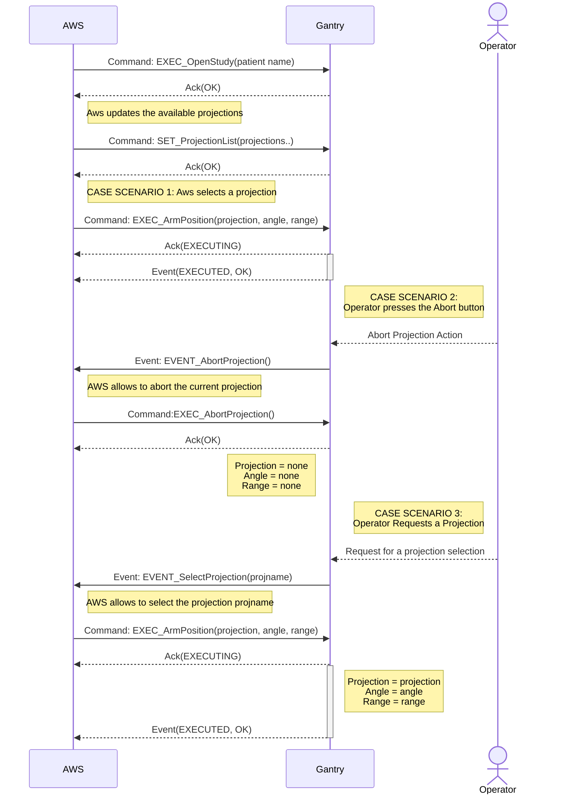
 

## 6.2. Trx Positioning Process Flowchart
 

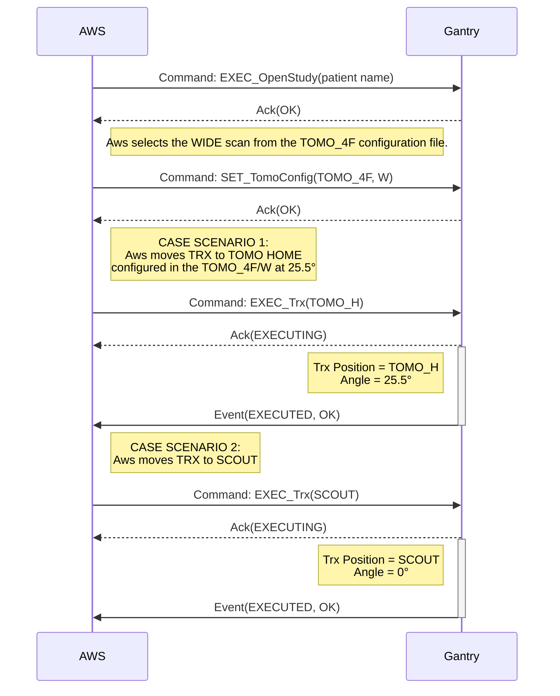
 

## 6.3. 2D Manual Exposure  Flowchart
 

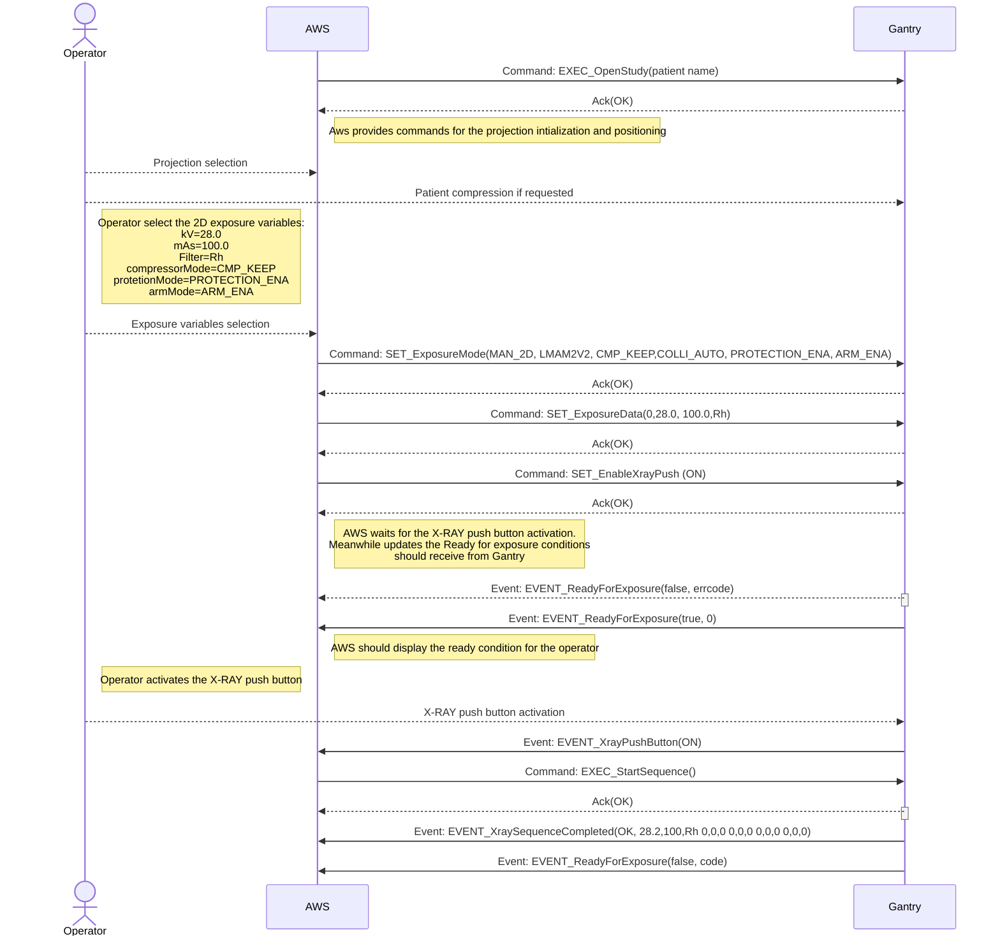

## 6.4. 2D AEC  Exposure  Flowchart
 

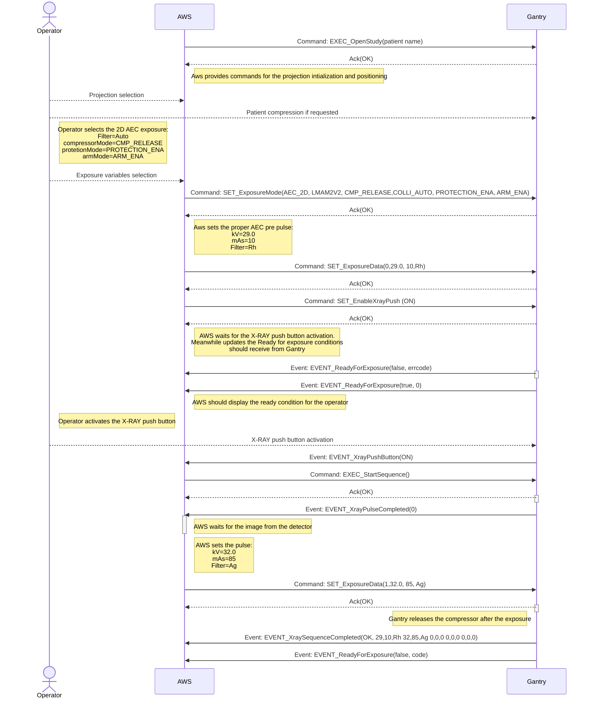

## 6.5. 3D Manual Exposure  Flowchart
 

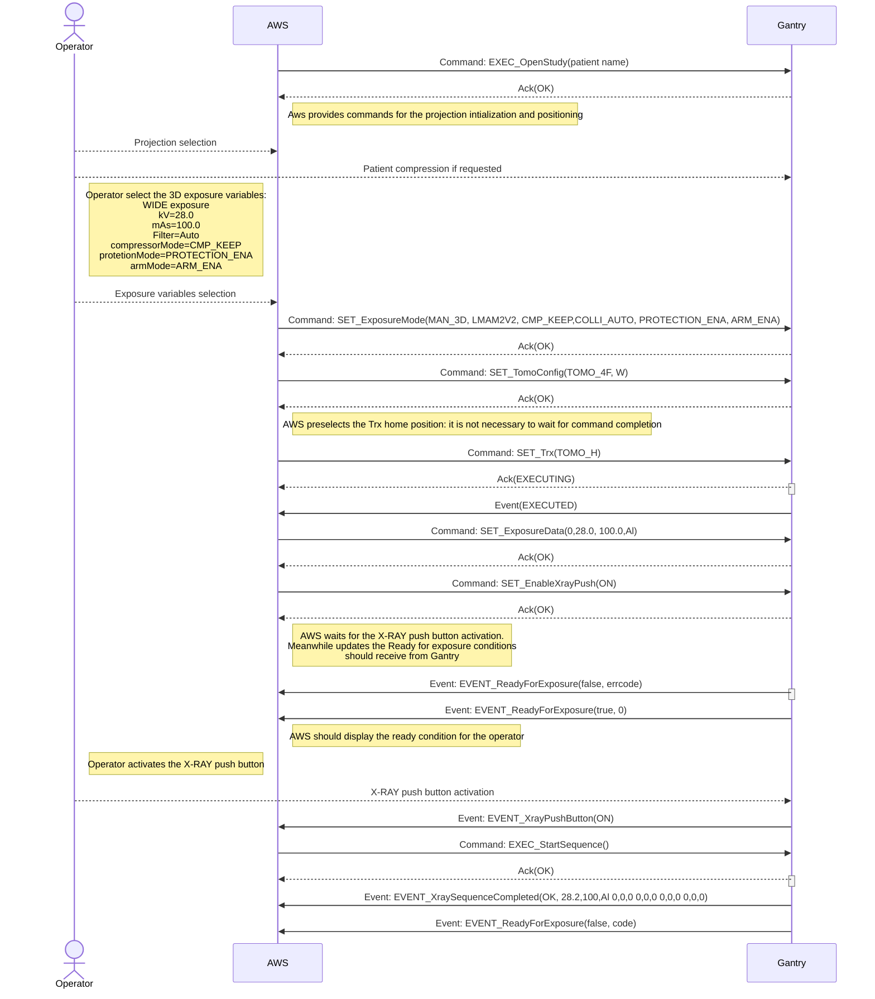

## 6.6. 3D AEC  Exposure  Flowchart
 

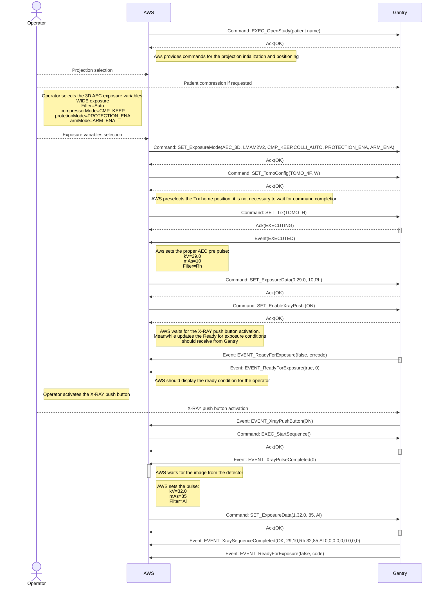

## 6.7. Combo Manual Exposure  Flowchart

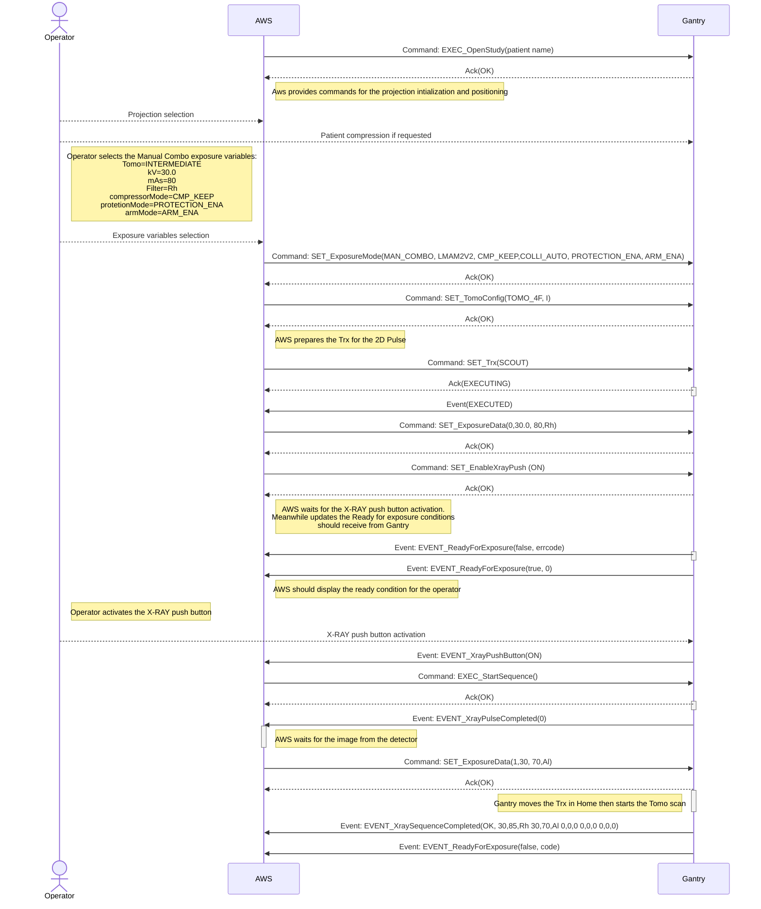

## 6.8. AEC Combo  Exposure  Flowchart

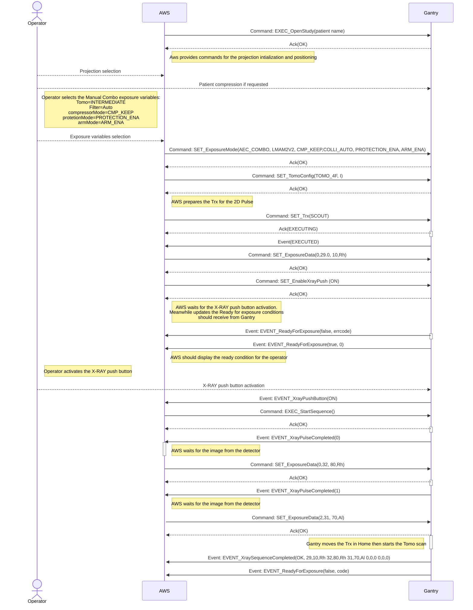

## 6.9. Dual Energy Manual Exposure  Flowchart
 

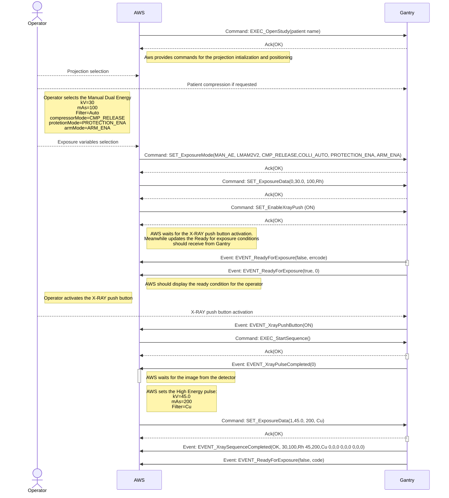

## 6.10. Dual Energy AEC Exposure  Flowchart
 

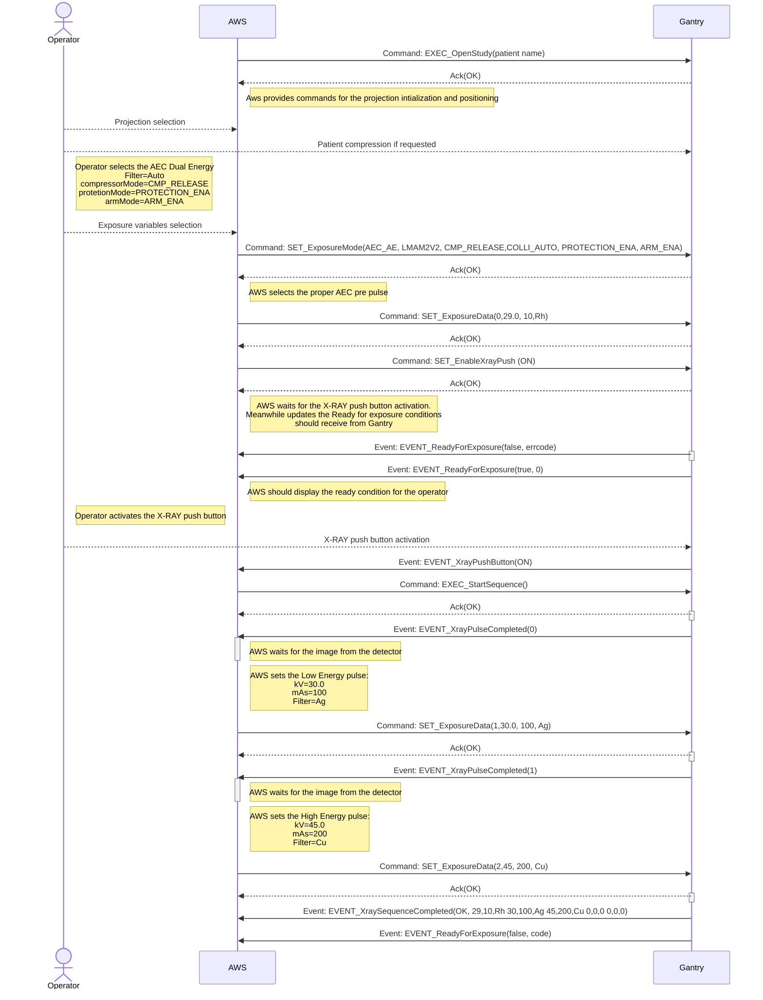

# 7. APPENDIX

## 7.1. Collimator Filter Table

|Parameter|*Filter*|
|:---|:---|
|Ag|Silver |
|Al| Alluminum |
|Mo|Molibdenum|
|Rh|Rhodium|
|Cu| Copper|

[Filter_List_Table]:#71-collimator-filter-table

## 7.2. Collimation Format Table

|Parameter|*Collimation*|
|:---|:---|
|COLLI_AUTO| The Exposure uses the Automatic collimation set by the current detected Paddle |
|COLLI_24x30| Force the 24x30 format |
|COLLI_18x24_C| Force the 18x24 CENTER format |
|COLLI_18x24_L| Force the 18x24 LEFT format |
|COLLI_18x24_R| Force the 18x24 RIGHT format |
|COLLI_9x21| Force the 9x21 (MAG) format |
|COLLI_10x24| Force the 10x24 format |
|COLLI_PROSTHESIS| Force the PROSTHESIS format |
|COLLI_D75| Force the D75 (MAG) format |
|COLLI_BIOP2D| Force the BIOPSY 2D format |
|COLLI_BIOP3D| Force the BIOPSY STEREO format |
|COLLI_TOMO| Force the TOMO 24x30 format |
|COLLI_9x9| Force the TOMO 9x9 (MAG) format |
|COLLI_CUSTOM| Force the custom format |

[Colli_Format_Table]:#72-collimation-format-table

## 7.3. Compressor Paddle Table

|Parameter|*comprPaddle*|
|:---|:---|
|PAD_24x30| Compressor Paddle 24x30 |
|PAD_18x24_C| Compressor Paddle 18x24 CENTER |
|PAD_18x24_L| Compressor Paddle 18x24 LEFT  |
|PAD_18x24_R| Compressor Paddle 18x24 RIGHT |
|PADCOLLI_9x21| Compressor Paddle 9x21 Magnifier |
|PAD_10x24| Compressor Paddle 10x24  |
|PAD_D75| Compressor Paddle D75 Magnifier|
|PAD_BIOP2D| Compressor Paddle BIOPSY 2D  |
|PAD_BIOP3D| Compressor Paddle  BIOPSY STEREO |
|PAD_TOMO| Compressor Paddle Tomo-24x30 |
|PAD_9x9| Compressor Paddle  9x9 Magnifier |
|PAD_UNDETECTED| Undetected Paddle |
|PAD_UNLOCKED| Paddle not locked |
|||

[Compressor_Paddle_Table]:#73-compressor-paddle-table

## 7.4. Arm Projection Table

|Parameter||*Projection tags*||
|:---:|:---:|:---:|:---:|
|LCC|LFB|LISO|LLM| 
| ||||
|||||
|LLMO|LML|LMLO|LSIO|
| | | | |
|||||
|RCC|RFB|RISO|RLM|
| | |  | |
|||||
|RLMO|RML|RMLO|RSIO|
| | | | |
|||||

[Arm_Projection_Table]:#74-arm-projection-table

## 7.5. Components Option Table

|Parameter|*magnifierModel*|
|:---|:---|
|COMPONENT_UNDETECTED| No component detected|
|PROTECTION_3D| Potter for 3D exposures|
|MAG_15| Magnifier device 1.5x|
|MAG_18| Magnifier device 1.8x|
|MAG_20| Magnifier device 2x|
|BIOPSY| Biopsy device detected|
|||

[Components_Option_Table]:#75-components-option-table

## 7.6. Collimator Component Table

|Parameter|*collyComponent*|
|:---|:---|
|COLLI_COMPONENT_UNDETECTED| No colly component has been detected|
|PROTECTION_2D| Potter for 2D only exposures|
|SHIFTED_PROTECTION| The protection tool has been detected but it is shifted forwards|
|LEAD_SCREEN| The LEad screen has been inserted|
|SPECIMEN| Tool for Biopsy Specimen Exposures (biopsy contest)|
|||

[Colli_Component_Table]:#76-collimator-component-table

## 7.7. TRX Target Table

|Parameter|*target TRX*|
|:---|:---|
|SCOUT| Trx in scout position|
|BP_R| Trx in Stereo right (for 2D biopsy)|
|BP_L| Trx in Stereo left (for 2D biopsy)|
|TOMO_H| Trx in Tomo Home position of the current selected tomo |
|TOMO_E| Trx in Tomo End position of the current selected tomo |
|||

[Trx_Target_Table]:#77-trx-target-table

## 7.8. Gantry Language Table

|Parameter|*Language*|
|:---|:---|
|ITA| Italian|
|FRA| French |
|ENG| English|
|PRT| Portuguese |
|RUS| Russian|
|ESP| Spanish |
|LTU| Lithuanian |
|||

[Gantry_Language_Table]:#78-gantry-language-table

## 7.9. Tomo Configuration File Description

Every Tomo-Scan sequence is defined by a set of parameters:

|Tomo-Scan Parameters|Description|
|:---|:---|
|Home| This is the Trx position at the beginning of the scan|
|End| This is the Trx position at the end of the scan|
|Acc| This is the acceleration rate from the Home position|
|Run| This is the speed in the scan area|
|Dec| This is the deceleration rate to the End position|
|Skip| This is the number of exposure window without radiation|
|n-pulse| This is the total number of valid samples in the scan|
||

+ There are a number of predefined Tomo-Scan the AWS can select.
+ Every Scan is assigned to a unique ScanId identifier into a Configuration file.
+ In a configuration file there are several ScanId with different characteristics;
+ There are several configuration files;

### 7.9.1. Tomo Configuration Table

|*TomoFileId=TOMO_1F*|||||
|:---|:---|:---|:---|:---|
|**ScanId**|**Fps**|**Samples**|**Angle**|**Skips**|
|N|1|11|15|1|
|I|1|13|24|1|
|W|1|19|36|1|
||

|*TomoFileId=TOMO_2F*|||||
|:---|:---|:---|:---|:---|
|**ScanId**|**Fps**|**Samples**|**Angle**|**Skips**|
|N|2|11|15|1|
|I|2|13|24|1|
|W|2|19|36|1|
||

|*TomoFileId=TOMO_3F*|||||
|:---|:---|:---|:---|:---|
|**ScanId**|**Fps**|**Samples**|**Angle**|**Skips**|
|N|2|11|15|1|
|I|2|13|24|1|
|W|2|24|50|1|
||

|*TomoFileId=TOMO_4F*|||||
|:---|:---|:---|:---|:---|
|**ScanId**|**Fps**|**Samples**|**Angle**|**Skips**|
|N|4|11|15|3|
|I|3|13|24|3|
|W|3|24|50|1|
||

|*TomoFileId=TOMO_5F*|||||
|:---|:---|:---|:---|:---|
|**ScanId**|**Fps**|**Samples**|**Angle**|**Skips**|
|N|1|11|15|1|
|I|1|13|24|1|
|W|1|24|50|1|
||

[Tomo_Scan_Table]:#791-tomo-configuration-table

## 7.10. Detector List Table

|Parameter|*detector*|
|:---|:---|
|LMAM2V2|Analogic LMAM2 V2 |
|LMAM2FDIV2|Analogic LMAM2 FDI-V2 |
||

[Detector_List_Table]:#710-detector-list-table

## 7.11. Exposure List Table

|Parameter|*ExpType*|
|:---|:---|
|MAN_2D|The next exposure is a 2D manual mode |
|AEC_2D|The next exposure is a 2D with AEC  |
|MAN_3D|The next exposure is a Tomo 3D in manual mode |
|AEC_3D|The next exposure is a Tomo 3D with AEC|
|MAN_COMBO | The next exposure is a Manual Combo|
|AEC_COMBO | The next exposure is a Combo with AEC|
|MAN_AE | The next exposure is a Dual energy exposure in manual mode|
|AEC_AE| The next exposure is a Dual energy with AEC|

[Exposure_List_Table]:#711-exposure-list-table

## 7.12. Not Ready For Exposure conditions

There are several conditions that can prevent an Exposure to be initiated. 

The Command() GET_ReadyForExposure() and the Event() EVENT_ReadyForExposure()
both return a 16 bit word with all the current errors preventing the Ready condition. 

Follows a table with the error bit description:

|BIT|*code*|
|:---|:---|
|0|Gantry is in error condition|
|1|Missing compression (if enabled)|
|2|Missing patient protection (if enabled)|
|3|Wrong Arm position detected |
|4|Wrong Paddle detected |
|5|Missing valid exposure mode |
|6|Missing valid exposure data |
|7|Xray Push Button Disabled |

[Not_Ready_List_Table]:#712-not-ready-for-exposure-conditions

## 7.13. Gantry Operating Status

The Gantry internal status is following described:

|Parameter|*Gantry Status*|
|:---|:---|
|GANTRY_STARTUP|The Gantry is executing the startup procedure|
|GANTRY_IDLE|The Gantry is in IDLE mode|
|GANTRY_OPEN_STUDY|The Gantry is in Open Study mode|
|GANTRY_SERVICE|The Gantry is in Service mode|
||

[Gantry_Status_Table]:#713-gantry-operating-status
